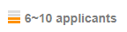
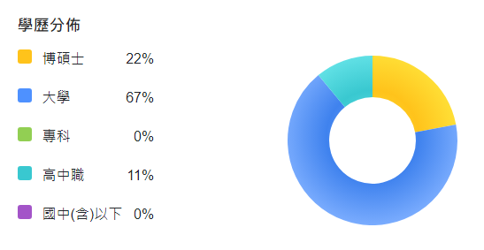
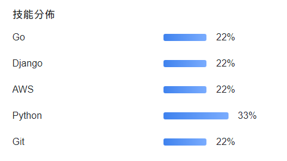

# Guess Number of Applicants

A Go program to deduce the possible number of applicants based on statistical data.

## The Story

Have you ever seen statistics on a job posting site and wondered how many people actually applied?

For example, you might see a range of applicants:



And you might also see the distribution of their educational backgrounds:



And their skills:



This project helps you take these percentages and the applicant range, and determine the possible number of total applicants.

## How to Use

1.  **Edit the `input.json` file:**

    ```json
    {
      "lowerBound": 6,
      "upperBound": 10,
      "proportions": [
        [22, 67, 11],
        [22, 22, 22, 33, 22]
      ]
    }
    ```

    *   `lowerBound`: The lower bound of the possible number of applicants.
    *   `upperBound`: The upper bound of the possible number of applicants.
    *   `proportions`: An array of proportion sets. Each proportion set is an array of percentages.

2.  **Run the program:**

    ```bash
    go run main.go
    ```

3.  **View the output:**

    The program will print the possible number(s) of applicants. For the example `input.json` above, the output will be:

    ```
    Possible numbers: [9]
    ```

## The Logic

The program works by iterating through each integer number in the range from `lowerBound` to `upperBound`. For each number, it checks if it satisfies all the given proportion sets.

A number `n` satisfies a proportion set if, for each percentage `p` in the set, the value `(p/100) * n` is very close to a whole number. This is because the number of people in any category must be an integer.

For example, if we are testing the number `9`:

*   For the education distribution `[22, 67, 11]`:
    *   `0.22 * 9 = 1.98` (close to 2)
    *   `0.67 * 9 = 6.03` (close to 6)
    *   `0.11 * 9 = 0.99` (close to 1)
    The sum of the rounded numbers is `2 + 6 + 1 = 9`, which matches the total number of applicants.

*   For the skill distribution `[22, 22, 22, 33, 22]`:
    *   `0.22 * 9 = 1.98` (close to 2)
    *   `0.33 * 9 = 2.97` (close to 3)
    Since all these values are close to whole numbers, `9` is considered a possible number of applicants.

The program is designed to handle two types of proportion data:
*   **Exclusive proportions:** where the sum of percentages is 100% (or very close to it), like the education distribution. Each item belongs to exactly one category.
*   **Non-exclusive proportions:** where the sum of percentages can be over 100%, like the skill distribution. An item can belong to multiple categories.
